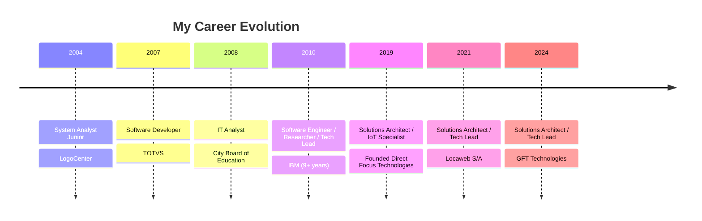

# Hi there, I'm Ton Goncalves 👋

  

## 🚀 About Me

I'm a passionate **Solutions Architect** and **Senior Software Engineer** with over 21 years of experience building innovative solutions for large-scale IT enterprises. Currently working as **Tech Lead / Solutions Architect at GFT Technologies**.

🎯 **Specialties**: Cloud Architecture | Microservices | IoT | Machine Learning | Blockchain  
📍 **Location**: Paraná, Brazil  
🏆 **Certified**: AWS Certified Solutions Architect | Scrum Master  

## 💼 Professional Journey

## 🛠️ Tech Stack

### Cloud & Infrastructure

### Backend Development

### Frontend & Mobile

### Databases & Messaging

## 📊 GitHub Analytics

  
  

## 🔥 Current Focus

- 🏗️ Building scalable microservices architectures
- 🤖 Implementing IoT solutions with Machine Learning
- ☁️ Designing cloud-native applications on AWS
- 📚 Writing technical articles on [Medium](https://medium.com/@thetonbr)
- 📖 Working on a book about **Go for Fraud Detection**
- 🏛️ Improve Go AI Packages
- 🦉 Teaching (Data Science and Compilers)

## 🌟 Featured Projects

  
  

## 📈 Contribution Graph

## 🎯 2025 Goals

- [ ] Launch Go for Fraud Detection book (In Progress...)
- [ ] Publish 24+ technical articles on Medium
- [ ] Contribute to major open-source projects
- [ ] Share knowledge through conference talks
- [ ] Build a strong developer community presence

## 📫 Let's Connect!

  

---

  
  
  ⚡ Fun fact: My Spotify playlists are as organized as my code: one for debugging, one for architecting, and one for deploy nights! 🎵💻

<!---
thetonbr/thetonbr is a ✨ special ✨ repository because its `README.md` (this file) appears on your GitHub profile.
You can click the Preview link to take a look at your changes.
--->
